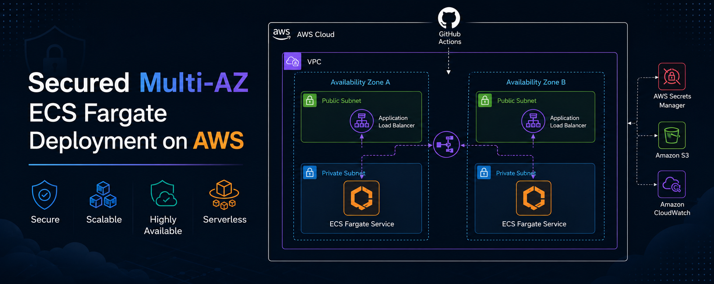

<details>
  <summary>Table of Contents</summary>
  <br>

  <ul>
    <li><a href="#about">About</a></li>
    <li><a href="#architecture-overview">Architecture Overview</a></li>
    <li>
      <a href="#features">Features</a>
      <ul>
        <li><a href="#infrastructure">Infrastructure</a></li>
        <li><a href="#security">Security</a></li>
        <li><a href="#trade-offs-optimized-for-personal-cost">Trade-Offs (Optimized for Personal Cost)</a></li>
      </ul>
    </li>
    <li><a href="#setup">Setup</a></li>
  </ul>

</details>

> [!IMPORTANT]
> This repository contains only the IaC layer for hosting the forked [`journal-starter`](https://github.com/z-fahmi-z/journal-starter) capstone. All application logic and service code reside in that separate repository for better SoC.

## About

This project demonstrates a secure, highly available containerized application deployment on AWS using ECS Fargate across multiple Availability Zones. Built as a personal portfolio project showcasing industry best practices for cloud infrastructure including IaC with Terraform, centralized logging and monitoring, and a zero-trust security model. The architecture is optimized for personal cost management while maintaining production-grade security and reliability standards.

## Architecture Overview

The infrastructure spans two Availability Zones (A and B) within a single AWS VPC, featuring:

- **Public subnets** hosting the Application Load Balancer (ALB) for traffic distribution.
- **Private subnets** containing ECS Fargate tasks running containerized applications.
- **Multi-AZ RDS deployment** with automated failover capabilities.
- **Serverless compute** using AWS Fargate for container orchestration.
- **Centralized networking** through VPC Endpoints for private AWS service access.


## Features

### Infrastructure

- **S3 State Locking**: Terraform state management for concurrent operations safety.
- **Multi-AZ Deployment**: High compute and database availability through distribution across two Availability Zones.
- **AWS Bedrock Integration**: AI/ML capabilities integrated into the application stack.
- **CloudWatch & CloudTrail**: Comprehensive logging, monitoring, and audit trail for all activities.
- **RDS + Lambda Initialization**: Automated database schema setup via Lambda functions on deployment.

### Security

- **AWS Certificate Manager (ACM)**: SSL/TLS certificate management for secure HTTPS communications.
- **AWS Secrets Manager (ASM)**: Secure storage and rotation of sensitive credentials.
- **IAM Groups (Dev & Ops)**: Least-privilege access control with separate groups for dev and ops teams.
- **Task IAM Roles**: Fine-grained permissions for ECS tasks to access required AWS services.
- **GitHub IAM Roles (OIDC)**: Secure GitHub Actions integration using OpenID Connect.

### Trade-Offs - _Optimized for Personal Cost_

- **VPC Endpoints vs NAT Gateways**: Reduces cost NAT Gateway ~$32/month to VPC Endpoints ~$7/month.
- **SSM vs EC2 Bastion**: No EC2 compute costs ~$15-30/month and public exposure.

## Setup

### Prerequisites

| Requirement | Version | Installation | Documentation |
|-------------|---------|--------------|---------------|
| **journal-starter** | Complete Phase 3 | [journal-starter](https://github.com/learntocloud/journal-starter) capstone | [LearnToCloud](https://learntocloud.guide/) |
| **Terraform** | 1.14+ | [Install Terraform CLI](https://developer.hashicorp.com/terraform/tutorials/aws-get-started/install-cli) | [Terraform](https://developer.hashicorp.com/terraform/docs) |
| **AWS CLI** | 2.34.6+ | [Install AWS CLI](https://docs.aws.amazon.com/cli/latest/userguide/getting-started-install.html) | [Amazon](https://docs.aws.amazon.com/cli/latest/userguide/) |
| **Docker** | 29.2+ | [Install Docker](https://docs.docker.com/get-docker/) | [Docker](https://docs.docker.com/) |
| **AWS Account** | - | Create an [AWS account](https://aws.amazon.com/) if you don't have one. | [Amazon](https://docs.aws.amazon.com/) |
| **Python** | 3.13 | [Install Python](https://www.python.org/downloads/) | [Python](https://docs.python.org/3/) |

### Local Setup

1. Navigate to the bootstrap directory and initialize Terraform:

```bash
cd bootstrap
terraform init
terraform plan
terraform apply --auto-approve
```

2. Note the ECR repository URI and IAM role outputs from the bootstrap apply. Use these to build and push your `journal-starter` container image:

> [!TIP]
> you should automate this in your own journal-starter capstone CI pipeline, since the arns are also provisioned by this project 

```bash
# From your completed journal-starter capstone root project directory
# Authenticate Docker to your ECR repository
aws ecr get-login-password --region <region> | docker login --username AWS --password-stdin <ecr-repo-uri>

# Build and push the local container image
docker build -t journal-starter .
docker tag journal-starter:latest <ecr-repo-uri>:latest
docker push <ecr-repo-uri>:latest
```

3. From the root directory, initialize and apply the main Terraform configuration:

```bash
# Navigate back to the root directory
cd ..

# Perform the same terraform workflow
terraform init
terraform plan
terraform apply --auto-approve
```

### Cleanup

To avoid incurring costs, destroy the infrastructure in the correct reverse sequence:

```bash
# Preview what will be destroyed in the main infrastructure
terraform plan -destroy
terraform destroy --auto-approve

# Navigate to the bootstrap directory and repeat the cleanup processes
cd bootstrap
terraform plan -destroy
terraform destroy --auto-approve
```

---

> [!NOTE]
> This project is actively maintained as a demonstration of modern AWS infrastructure patterns. Feel free to explore the code and adapt it for your own learning purposes.